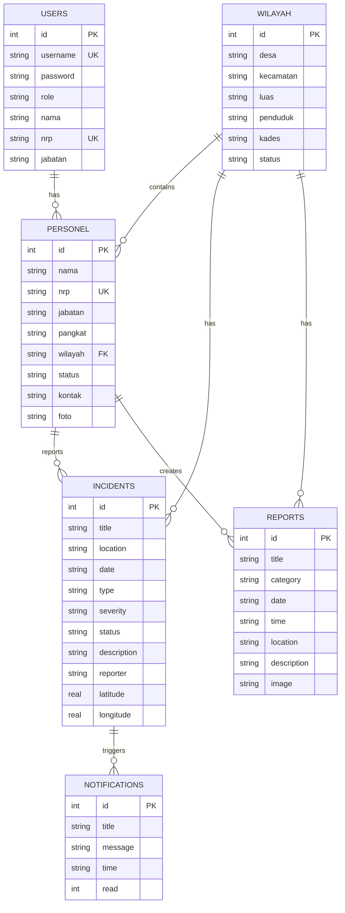

# Entity Relationship Diagram (ERD) - SISTER
## Sistem Informasi Strategi Pertahanan Regional

**Aplikasi:** SISTER (Sistem Informasi Strategi Pertahanan Regional)  
**Database:** SQLite  
**Tanggal Pembuatan:** 2026-06-03

---

## 📊 DAFTAR ENTITIES (7 ENTITAS)

### 1. **USERS** (Manajemen Pengguna & Autentikasi)
**Fungsi:** Mengelola akun pengguna, role, dan autentikasi sistem

| Atribut | Tipe Data | Constraint | Keterangan |
|---------|-----------|-----------|-----------|
| `id` | INTEGER | PRIMARY KEY, AUTO INCREMENT | Identitas unik pengguna |
| `username` | TEXT | UNIQUE, NOT NULL | Username login (unik per akun) |
| `password` | TEXT | NOT NULL | Password pengguna (hashed) |
| `role` | TEXT | NOT NULL | Role: 'danramil', 'babinsa', 'admin' |
| `nama` | TEXT | NOT NULL | Nama lengkap pengguna |
| `nrp` | TEXT | UNIQUE | Nomor Registrasi Personel (TNI) |
| `jabatan` | TEXT | | Jabatan/Posisi (Danramil, Babinsa, dll) |

**Primary Key:** `id`  
**Unique Constraints:** `username`, `nrp`  
**Relationships:** 
- ONE-to-MANY dengan PERSONEL (User bisa reference ke Personel record)

---

### 2. **WILAYAH** (Data Wilayah Pertahanan)
**Fungsi:** Menyimpan data wilayah administratif yang dimonitor

| Atribut | Tipe Data | Constraint | Keterangan |
|---------|-----------|-----------|-----------|
| `id` | INTEGER | PRIMARY KEY, AUTO INCREMENT | ID wilayah |
| `desa` | TEXT | NOT NULL | Nama desa/kelurahan |
| `kecamatan` | TEXT | NOT NULL | Nama kecamatan |
| `luas` | TEXT | | Luas wilayah (km²) |
| `penduduk` | TEXT | | Jumlah penduduk |
| `kades` | TEXT | | Nama Kepala Desa |
| `status` | TEXT | DEFAULT 'Aman' | Status keamanan (Aman, Waspada, Rawan) |

**Primary Key:** `id`  
**Relationships:**
- ONE-to-MANY dengan PERSONEL (Satu wilayah punya banyak personel)
- ONE-to-MANY dengan INCIDENTS (Satu wilayah punya banyak insiden)
- ONE-to-MANY dengan REPORTS (Satu wilayah punya banyak laporan)

---

### 3. **PERSONEL** (Data Personel/Anggota)
**Fungsi:** Mengelola data personel TNI yang bertugas di wilayah

| Atribut | Tipe Data | Constraint | Keterangan |
|---------|-----------|-----------|-----------|
| `id` | INTEGER | PRIMARY KEY, AUTO INCREMENT | ID personel |
| `nama` | TEXT | NOT NULL | Nama lengkap personel |
| `nrp` | TEXT | UNIQUE, NOT NULL | Nomor Registrasi Personel |
| `jabatan` | TEXT | NOT NULL | Jabatan (Danramil, Babinsa, Batuud, dll) |
| `pangkat` | TEXT | | Pangkat militer (Kapten, Sersan, Peltu, dll) |
| `wilayah` | TEXT | FOREIGN KEY | ID atau nama wilayah tempat bertugas |
| `status` | TEXT | | Status personel (Aktif, Cuti, Pensiun) |
| `kontak` | TEXT | | Nomor kontak (HP/Telepon) |
| `foto` | TEXT | | URL/Path foto profil personel |

**Primary Key:** `id`  
**Foreign Key:** `wilayah` → WILAYAH(`id` atau `desa`)  
**Unique Constraints:** `nrp`  
**Relationships:**
- MANY-to-ONE dengan WILAYAH (Banyak personel di satu wilayah)

---

### 4. **REPORTS** (Laporan Kejadian/Kegiatan)
**Fungsi:** Mencatat laporan kejadian atau kegiatan pertahanan

| Atribut | Tipe Data | Constraint | Keterangan |
|---------|-----------|-----------|-----------|
| `id` | INTEGER | PRIMARY KEY, AUTO INCREMENT | ID laporan |
| `title` | TEXT | NOT NULL | Judul laporan |
| `category` | TEXT | NOT NULL | Kategori laporan |
| `date` | TEXT | NOT NULL | Tanggal laporan (YYYY-MM-DD) |
| `time` | TEXT | | Waktu kejadian (HH:MM) |
| `location` | TEXT | NOT NULL | Lokasi kejadian |
| `description` | TEXT | | Deskripsi detail laporan |
| `image` | TEXT | | URL/Base64 foto/gambar dokumentasi |

**Primary Key:** `id`  
**Relationships:**
- MANY-to-ONE dengan WILAYAH (via location field - implicit join)
- MANY-to-ONE dengan PERSONEL (reporter - implicit join, perlu foreign key)

---

### 5. **INCIDENTS** (Insiden Keamanan/Peristiwa Strategis)
**Fungsi:** Mengelola laporan insiden keamanan dan ancaman potensial

| Atribut | Tipe Data | Constraint | Keterangan |
|---------|-----------|-----------|-----------|
| `id` | INTEGER | PRIMARY KEY, AUTO INCREMENT | ID insiden |
| `title` | TEXT | NOT NULL | Judul insiden |
| `location` | TEXT | NOT NULL | Lokasi insiden |
| `date` | TEXT | NOT NULL | Tanggal insiden (YYYY-MM-DD) |
| `type` | TEXT | NOT NULL | Tipe insiden (Ideologi, Sosial, Keamanan, dll) |
| `severity` | TEXT | DEFAULT 'Waspada' | Tingkat keparahan (Siaga, Waspada, Rawan) |
| `status` | TEXT | DEFAULT 'Baru' | Status penanganan (Baru, Proses, Selesai) |
| `description` | TEXT | | Deskripsi detail insiden |
| `reporter` | TEXT | NOT NULL | Siapa yang melapor (Warga, Babinsa, dll) |
| `latitude` | REAL | | Koordinat GPS latitude |
| `longitude` | REAL | | Koordinat GPS longitude |

**Primary Key:** `id`  
**Relationships:**
- MANY-to-ONE dengan WILAYAH (via location - implicit, perlu foreign key)
- MANY-to-ONE dengan PERSONEL (reporter - implicit, perlu foreign key)
- ONE-to-MANY dengan NOTIFICATIONS (Insiden baru → Notifikasi otomatis)

---

### 6. **NOTIFICATIONS** (Sistem Notifikasi)
**Fungsi:** Menyimpan notifikasi sistem untuk alert real-time

| Atribut | Tipe Data | Constraint | Keterangan |
|---------|-----------|-----------|-----------|
| `id` | INTEGER | PRIMARY KEY, AUTO INCREMENT | ID notifikasi |
| `title` | TEXT | NOT NULL | Judul notifikasi |
| `message` | TEXT | NOT NULL | Isi pesan notifikasi |
| `time` | TEXT | NOT NULL | Waktu notifikasi dikirim |
| `read` | INTEGER | DEFAULT 0 | Status dibaca (0=belum, 1=sudah dibaca) |

**Primary Key:** `id`  
**Relationships:**
- MANY-to-ONE dengan INCIDENTS (via trigger - notifikasi dibuat saat incident dibuat)

---

## 🔗 RELATIONAL MAPPING (Hubungan Antar Entitas)

```
USERS (1)
  ├── dapat-mengakses --> DASHBOARD
  ├── dapat-membuat --> REPORTS
  └── dapat-membuat --> INCIDENTS

WILAYAH (1) 
  ├── (1) ---ONE-to-MANY--- (∞) PERSONEL
  │   └── Satu wilayah memiliki banyak personel
  ├── (1) ---ONE-to-MANY--- (∞) INCIDENTS  
  │   └── Satu wilayah punya banyak insiden
  └── (1) ---ONE-to-MANY--- (∞) REPORTS
      └── Satu wilayah punya banyak laporan

PERSONEL (∞)
  ├── (∞) ---MANY-to-ONE--- (1) WILAYAH
  │   └── Banyak personel ditempatkan di satu wilayah
  └── dapat-membuat --> REPORTS / INCIDENTS

REPORTS (∞)
  └── (∞) ---MANY-to-ONE--- (1) WILAYAH (implicit via location)

INCIDENTS (∞)
  ├── (∞) ---MANY-to-ONE--- (1) WILAYAH (implicit via location)
  ├── (1) ---ONE-to-MANY--- (∞) NOTIFICATIONS
  │   └── Saat incident dibuat, notifikasi otomatis tercipta
  └── dapat-dilaporkan-oleh --> PERSONEL / WARGA

NOTIFICATIONS (∞)
  └── berhubungan-dengan --> INCIDENTS
```

---

## 📐 ENTITY RELATIONSHIP DIAGRAM (Text Format)

```
┌─────────────┐
│   USERS     │
├─────────────┤
│ id (PK)     │
│ username*   │◄─── LOGIN
│ password    │
│ role        │
│ nama        │
│ nrp*        │
│ jabatan     │
└─────────────┘

┌──────────────────────────────────────────────────────┐
│             DASHBOARD FEATURES                        │
├──────────────────────────────────────────────────────┤
│ 1. Data Wilayah                                      │
│ 2. Manajemen Personel                                │
│ 3. Laporan Kejadian (Reports)                        │
│ 4. Insiden Keamanan (Incidents/Keamanan)             │
│ 5. Peta Spasial (Maps with GPS coordinates)          │
│ 6. Piket/Jadwal                                      │
│ 7. Profil Pengguna                                   │
└──────────────────────────────────────────────────────┘

        ┌────────────┐                ┌──────────────┐
        │  WILAYAH   │                │  PERSONEL    │
        ├────────────┤                ├──────────────┤
        │ id (PK)    │◄───────────────│ wilayah (FK) │
        │ desa       │   1────────∞   │ id (PK)      │
        │ kecamatan  │                │ nama         │
        │ luas       │                │ nrp*         │
        │ penduduk   │                │ jabatan      │
        │ kades      │                │ pangkat      │
        │ status     │                │ status       │
        └────────────┘                │ kontak       │
             │                        │ foto         │
             │                        └──────────────┘
             │
      ┌──────┴──────┐
      │             │
      │             │
      ▼             ▼
  ┌─────────┐  ┌─────────────┐
  │ REPORTS │  │ INCIDENTS   │
  ├─────────┤  ├─────────────┤
  │ id (PK) │  │ id (PK)     │
  │ title   │  │ title       │
  │ category│  │ location    │
  │ date    │  │ date        │
  │ time    │  │ type        │
  │ location│  │ severity    │
  │ desc    │  │ status      │
  │ image   │  │ description │
  └─────────┘  │ reporter    │
               │ latitude    │
               │ longitude   │
               └─────────────┘
                     │
                     │ 1───────∞
                     │
               ┌─────────────┐
               │NOTIFICATIONS│
               ├─────────────┤
               │ id (PK)     │
               │ title       │
               │ message     │
               │ time        │
               │ read (0/1)  │
               └─────────────┘
```

---

## 🎯 FITUR APLIKASI & ENTITY MAPPING

| Fitur | Related Entities | Tipe Operasi |
|-------|-------------------|------------|
| **Login** | USERS | CREATE (session), READ (authentication) |
| **Dashboard** | WILAYAH, PERSONEL, INCIDENTS, NOTIFICATIONS | READ (overview, statistics) |
| **Data Wilayah** | WILAYAH | CREATE, READ, UPDATE, DELETE |
| **Manajemen Personel** | PERSONEL, WILAYAH | CREATE, READ, UPDATE, DELETE |
| **Laporan Kejadian** | REPORTS, WILAYAH | CREATE, READ, DELETE |
| **Insiden Keamanan** | INCIDENTS, WILAYAH, NOTIFICATIONS | CREATE, READ, UPDATE, DELETE |
| **Peta Spasial** | INCIDENTS (GPS coords), WILAYAH | READ (geo-mapping) |
| **Piket/Jadwal** | PERSONEL, WILAYAH | READ, CREATE |
| **Profil Pengguna** | USERS | READ, UPDATE |
| **Notifikasi** | NOTIFICATIONS, INCIDENTS | READ, UPDATE (mark-read) |

---

## 🔐 DATA INTEGRITY & CONSTRAINTS

### Primary Keys (PK)
- Semua entity memiliki `id` sebagai PRIMARY KEY dengan AUTO INCREMENT
- Menjamin setiap record unik dan dapat diidentifikasi

### Unique Constraints
- **USERS.username**: Tidak ada user dengan username sama
- **USERS.nrp**: NRP personel unik
- **PERSONEL.nrp**: NRP personel unik

### Foreign Keys (Perlu ditambahkan untuk integritas data)

| FK | From Table | To Table | Relationship |
|----|-----------|----------|-------------|
| `wilayah_id` | PERSONEL | WILAYAH | MANY-to-ONE |
| `wilayah_id` | INCIDENTS | WILAYAH | MANY-to-ONE (implicit) |
| `wilayah_id` | REPORTS | WILAYAH | MANY-to-ONE (implicit) |
| `incident_id` | NOTIFICATIONS | INCIDENTS | MANY-to-ONE |
| `reporter_id` | INCIDENTS | PERSONEL | MANY-to-ONE (optional) |
| `created_by` | REPORTS | USERS | MANY-to-ONE (optional) |

### Default Values
- `WILAYAH.status` = 'Aman'
- `INCIDENTS.severity` = 'Waspada'
- `INCIDENTS.status` = 'Baru'
- `NOTIFICATIONS.read` = 0

---

## 📋 CARDINALITY RULES

| Relationship | Cardinality | Explanation |
|-------------|------------|-------------|
| WILAYAH → PERSONEL | 1:∞ | Satu wilayah bisa punya banyak personel |
| WILAYAH → INCIDENTS | 1:∞ | Satu wilayah bisa punya banyak insiden |
| WILAYAH → REPORTS | 1:∞ | Satu wilayah bisa punya banyak laporan |
| INCIDENTS → NOTIFICATIONS | 1:∞ | Satu insiden dapat memicu banyak notifikasi |
| USERS → PERSONEL | 1:1 (optional) | Satu user bisa merupakan satu personel |

---

## 🔄 BUSINESS RULES

1. **Keamanan Data**
   - Setiap user harus login dengan username & password
   - Role menentukan akses fitur (danramil, babinsa, admin)

2. **Validasi Wilayah**
   - Setiap personel harus ditempatkan di wilayah yang ada
   - Status wilayah dapat berubah dari Aman → Waspada → Rawan

3. **Manajemen Insiden**
   - Setiap insiden auto-membuat notifikasi saat dibuat
   - Status insiden: Baru → Proses → Selesai
   - Severity: Siaga > Waspada > Normal

4. **Notifikasi**
   - Notifikasi otomatis dibuat saat insiden baru dilaporkan
   - Admin dapat mark-read notifikasi untuk dismiss alert
   - Maksimal 20 notifikasi terbaru ditampilkan

5. **Koordinat GPS**
   - Insiden menyimpan latitude/longitude untuk geo-mapping
   - Peta spasial menampilkan insiden berdasarkan GPS coordinates

---

## 💾 DATABASE OPTIMIZATION

### Indexes yang Direkomendasikan
```sql
CREATE INDEX idx_personel_wilayah ON personel(wilayah);
CREATE INDEX idx_incidents_location ON incidents(location);
CREATE INDEX idx_incidents_date ON incidents(date);
CREATE INDEX idx_reports_date ON reports(date);
CREATE INDEX idx_notifications_read ON notifications(read);
```

### Query Performance Tips
1. Filter by `date` dan `wilayah` untuk mengurangi result set
2. Gunakan pagination untuk REPORTS dan INCIDENTS
3. Cache notifications untuk loading lebih cepat

---

## 📝 IMPLEMENTASI LANGKAH DEMI LANGKAH

### Phase 1: Core Entities (Sudah ada)
- ✅ USERS
- ✅ WILAYAH
- ✅ PERSONEL
- ✅ REPORTS
- ✅ INCIDENTS
- ✅ NOTIFICATIONS

### Phase 2: Rekomendasi Perbaikan
- ⚠️ Tambah FOREIGN KEYS eksplisit untuk data integrity
- ⚠️ Tambah CREATED_BY dan UPDATED_BY fields untuk audit trail
- ⚠️ Tambah CREATED_AT dan UPDATED_AT timestamps
- ⚠️ Tambah REPORTER_ID FK di INCIDENTS ke PERSONEL
- ⚠️ Tambah INCIDENT_ID FK di NOTIFICATIONS

### Phase 3: Advanced Features (Future)
- 🔜 Tambah tabel SCHEDULE/PIKET dengan FK ke PERSONEL
- 🔜 Tambah tabel LOG/AUDIT_TRAIL
- 🔜 Tambah tabel ATTACHMENT untuk dokumentasi
- 🔜 Tambah tabel STATUS_HISTORY untuk tracking perubahan status
- 🔜 Multi-level approval workflow untuk reports/incidents

---

## 📊 SAMPLE DATA VOLUME ESTIMATES

| Entity | Typical Volume | Notes |
|--------|--------------|-------|
| USERS | 10-50 | Danramil, Babinsa, Admin |
| WILAYAH | 8-20 | Per kecamatan/desa |
| PERSONEL | 20-100 | Personel aktif per ramil |
| REPORTS | 50-1000/bulan | Laporan kejadian harian |
| INCIDENTS | 5-50/bulan | Insiden keamanan strategis |
| NOTIFICATIONS | 100-500/bulan | Auto-generated saat insiden |

---

## 🎨 MERMAID ERD (Untuk Visualisasi)



---

**Dibuat untuk:** Dokumentasi SISTER ERD  
**Status:** Draft - Siap untuk implementasi dan review  
**Last Updated:** 2026-06-03
